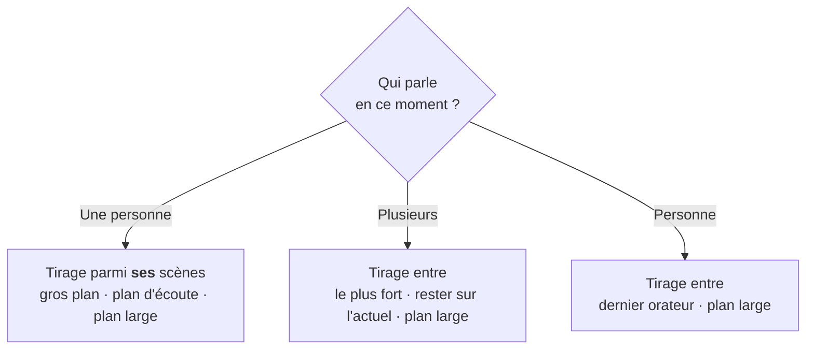

# Flowspire

> **Langues** : [English](README.md) · **Français** *(cette page)*

### Le réalisateur **automatique et organique** pour vos lives multicam dans OBS.

Il met en grand la personne **qui parle**, de façon **organique** — sans aucun driver ni câble audio virtuel. Vous ne touchez plus à une caméra pendant l'émission.

---

## Regardez-le suivre la conversation

Plusieurs intervenants, une seule règle : **on montre qui parle.** Flowspire écoute le son à l'intérieur d'OBS et bascule tout seul, en douceur.


*Au repos, le **plan large** : tout le monde est là.*


*Mia prend la parole → Flowspire la met **en grand**, automatiquement.*


*Ryan enchaîne → la caméra le suit **instantanément**. Vous n'avez rien touché.*

> Le rendu ressemble à une vraie production TV… sauf qu'il n'y a **personne** derrière la régie.

---

## À quoi ça sert

Quand vous animez une émission à plusieurs — talk, podcast filmé, table ronde, invités à distance — garder une vidéo **vivante** demande normalement quelqu'un qui bascule la caméra sur celui qui parle. Sans ça, on se rabat sur une **grille fixe** où tout le monde est affiché en permanence : plat et statique.

**Flowspire fait ce travail à votre place.** Il écoute le son de chaque participant *dans OBS* et **bascule sur la bonne scène** dès que quelqu'un prend la parole — en douceur, jamais de façon mécanique ou nerveuse.

### Marche avec **toutes vos sources** et **toutes vos scènes**

Flowspire raisonne uniquement en **sources audio** et en **scènes OBS**. La règle est simple : **dès qu'un vu-mètre bouge dans le mélangeur d'OBS, Flowspire peut réaliser dessus.** Une source, c'est :

- votre **micro physique** local,
- un invité connecté via **VDO.Ninja**,
- une capture **NDI**, un navigateur, une carte d'acquisition,
- … bref, **n'importe quelle entrée du mélangeur audio d'OBS**.

Côté image, il pilote **les scènes que vous avez créées** (gros plan, plan d'écoute, plan large, avec vos overlays). Il se contente de les **afficher au bon moment** : il ne crée, ne modifie et ne supprime **jamais** rien dans votre projet OBS.

### Sans aucun driver ni câble audio virtuel

C'est le parti pris fondateur : Flowspire lit les niveaux audio **nativement dans OBS**. **Aucun driver, aucun câble virtuel, aucun routage externe** — rien qui puisse alourdir ou déstabiliser votre machine. Vous installez le plugin, et c'est tout.

> **En résumé : si ça produit du son dans OBS et que vous avez des scènes, Flowspire sait réaliser avec — sans rien brancher de plus.**

---

## Le dock, en temps réel


Un panneau OBS clair : qui parle, la scène **à l'antenne** (le trait rouge), l'**interrupteur** marche/arrêt, et un **curseur de sensibilité** par personne — réglable **en plein direct**. Le reste du pilotage passe par vos scènes OBS et vos raccourcis : le dock reste épuré.

---

## Ce que ça fait

- **Détecte qui parle** via les niveaux audio internes d'OBS — sans driver ni câble virtuel.
- **Bascule la scène automatiquement** sur la personne active, de façon organique.
- **Mapping illimité** : autant de couples *source audio → scène(s)* que vous voulez.
- **Variété des plans** : plusieurs scènes pour une même personne (gros plan, plan d'écoute…) → le plugin **alterne** pour éviter la monotonie.
- **Plan large** de repli quand plusieurs parlent ou que personne ne parle.
- **Raccourcis OBS natifs** (clavier **et Stream Deck**) : marche/arrêt, plan large, forcer une personne.
- **Profils** : une config par type d'émission, bascule en un clic.
- **Assistant** pas-à-pas — tout se règle sans toucher au moindre fichier.
- **Multilingue** (français + anglais).
- **Stable** : conçu pour ne jamais déstabiliser ni faire crasher OBS (priorité n°1).

---

## « Organique, jamais mécanique »

Flowspire ne suit **jamais une règle rigide** du type « X parle → on montre X, point ». À chaque décision, il fait un **tirage au sort pondéré** parmi plusieurs choix. C'est ce qui donne le naturel : deux situations identiques ne produisent pas forcément le même plan — exactement comme un humain derrière la régie.

Il distingue **trois situations**, chacune avec son propre tirage :



Par-dessus, des **garde-fous** évitent la nervosité : **temps mini** d'un plan (pas de coupe sur un rire), **délai de silence** (pas de coupe sur une respiration), **temps maxi** (on rafraîchit pour varier), **anti ping-pong** (pas d'aller-retour quand deux personnes s'interrompent).

> **Les poids sont des proportions, pas des pourcentages.** *Gros plan 90* + *plan large 10* → vous verrez le gros plan ~90 % du temps. Le plugin calcule le % tout seul.

---

## Installation express

1. Récupérez `flowspire.dll` (Windows) / `.so` (Linux) / `.plugin` (macOS) depuis une **release**, ou compilez-le.
2. Copiez-le dans le dossier des plugins d'OBS, puis **(re)lancez OBS**.
3. Menu **Docks → Flowspire** pour afficher le panneau.

> Nécessite **OBS 28 ou supérieur**.

**Première utilisation ?** Le [**Guide utilisateur complet**](docs/guide.fr.md) vous accompagne de A à Z : préparer vos scènes, l'assistant écran par écran, et chaque réglage expliqué — avec captures.

---

## Aller plus loin

- **[Guide utilisateur complet](docs/guide.fr.md)** — préparer ses scènes, assistant, tous les réglages.
- **[Build & développement](#build--développement)** — compiler le plugin soi-même.

---

## Build & développement

Plugin natif **C++ / CMake** bâti sur l'`obs-plugintemplate` officiel, **multi-OS** (Windows · macOS · Linux). Licence **GPLv2+** (imposée par le lien à libobs).

```bat
scripts\dev-build.bat      :: cœur + tests (rapide, sans OBS)
scripts\build-plugin.bat   :: plugin complet (1er run : télécharge libobs + Qt6)
scripts\install-local.bat  :: installe le plugin dans OBS (OBS doit être fermé)
```

Le **cœur de décision** (`src/core`) est **pur** (aucune dépendance OBS) et **testé** unitairement (doctest/CTest) — on peut faire évoluer la logique de réalisation sans OBS.

**Versionnage sémantique** (`MAJEUR.MINEUR.CORRECTIF`), source unique dans `buildspec.json`, script `scripts\bump-version.py`.

**Les builds tournent à la demande, pas à chaque merge.** Les pull requests sont buildées pour validation ; sinon, on déclenche un build soi-même depuis **Actions → Dispatch → Run workflow** (compile les 3 OS et téléverse les installeurs en artefacts téléchargeables).

**Publier une version** — incrémenter la version, puis taguer et pousser :

```bash
python scripts/bump-version.py minor      # ou patch / major
git commit -am "feat : v0.3.0"
git tag -a 0.3.0 -m "v0.3.0"              # tag annoté (poussé par --follow-tags)
git push --follow-tags
# astuce : tag -a 0.3.0-rc1 pour un essai à blanc de tout le flux (pré-release)
```

Le tag déclenche le CI : build des 3 OS, fabrication des installeurs — **`.exe` Windows** (Inno Setup, → `cmake/windows/resources/installer-Windows.iss`), **`.pkg` macOS**, **`.deb` Linux** — et création d'une **Release GitHub en brouillon** avec checksums, que tu relis avant de publier. Installeurs **non signés** (étape SmartScreen/Gatekeeper une fois, voir le [guide](docs/guide.fr.md)).

---

## Crédits & inspiration

Flowspire s'inspire de **[Gabin](https://github.com/one-click-studio/gabin)**, le réalisateur automatique open source de **[One Click Studio](https://oneclickstudio.fr)** (licence MIT). Gabin a posé l'idée d'une réalisation **organique** pilotée par le son ; Flowspire en reprend l'esprit pour l'amener **nativement dans OBS, sans driver ni câble audio virtuel**.

## Licence

[GPL-2.0-or-later](LICENSE). Gratuit et open source.

## Soutenir

Flowspire est **gratuit et open source — aucune fonction n'est jamais bloquée**. S'il vous fait gagner du temps sur vos lives, un petit coup de pouce aide à le maintenir :

[](https://paypal.me/DavidZouari)

*(Le bouton **Soutenir** est aussi accessible directement dans les paramètres du plugin.)*
