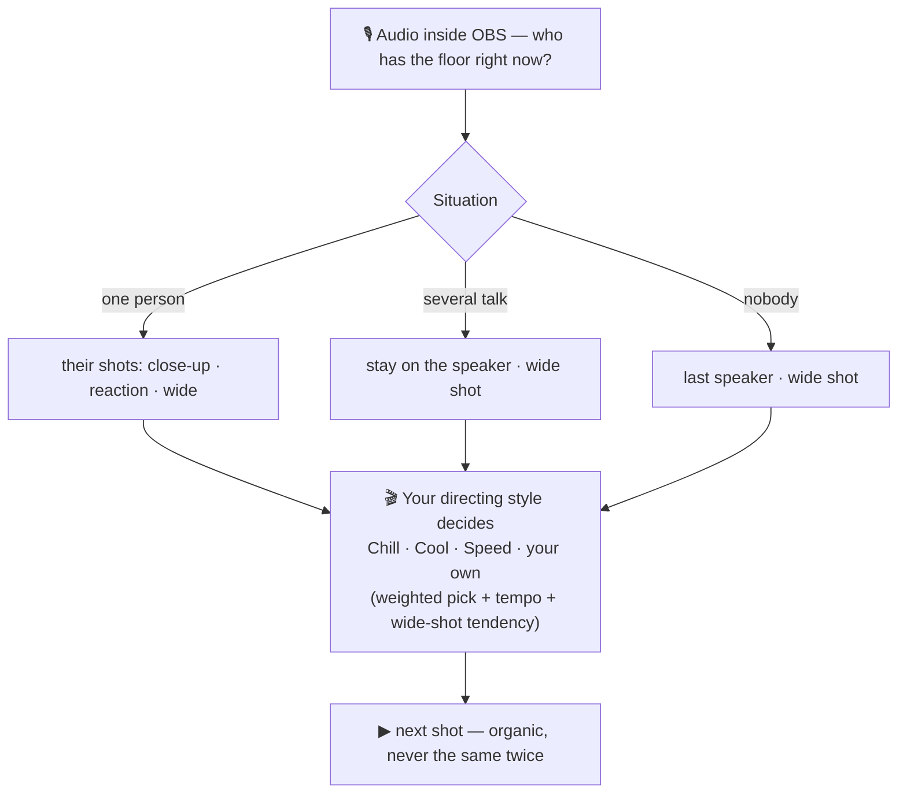

# Flowspire

> **Languages**: **English** *(this page)* · [Français](README.fr.md)

### The **automatic and organic** director for your multicam livestreams in OBS.

It puts whoever is **speaking** front and center, in an **organic** way — with no driver and no virtual audio cable. You never touch a camera again during the show.

---

## Watch it follow the conversation

Several speakers, no fixed grid. Flowspire doesn't just "show whoever talks" — it **directs**: it follows who has the floor, but also varies the shots and pulls back to the group, **with the feel you chose** (Chill, Cool, Speed…). It listens to the audio inside OBS and switches on its own — smoothly, **never mechanically**.


*At rest, the **wide shot**: everyone is there.*


*Mia starts talking → Flowspire puts her **center stage**, automatically.*


*Ryan jumps in → the camera follows him **instantly**. You didn't touch a thing.*

> The result looks like a real TV production… except there's **nobody** running the control room.

---

## What it's for

When you host a multi-person show — talk show, filmed podcast, panel, remote guests — keeping the video **alive** normally takes someone to switch the camera to whoever is talking. Without that, you fall back on a **fixed grid** where everyone is shown all the time: flat and static.

**Flowspire does that job for you.** It listens to each participant's audio *inside OBS* and **switches to the right scene** the moment someone speaks up — smoothly, never in a mechanical or jittery way.

### Works with **all your sources** and **all your scenes**

Flowspire thinks only in terms of **audio sources** and **OBS scenes**. The rule is simple: **as soon as an audio meter moves in the OBS mixer, Flowspire can direct on it.** A source can be:

- your local **physical microphone**,
- a guest connected through **VDO.Ninja**,
- an **NDI** capture, a browser, a capture card,
- … in short, **any input in the OBS audio mixer**.

On the visual side, it drives **the scenes you created** (close-up, reaction shot, wide shot, with your overlays). It simply **shows them at the right moment**: it **never** creates, modifies or deletes anything in your OBS project.

### With no driver and no virtual audio cable

That's the founding principle: Flowspire reads audio levels **natively inside OBS**. **No driver, no virtual cable, no external routing** — nothing that could weigh down or destabilize your machine. You install the plugin, and that's it.

> **In short: if it makes sound in OBS and you have scenes, Flowspire can direct with it — without plugging in anything else.**

---

## The dock, in real time


A clean OBS panel: who is speaking, the scene **on air** (the red bar), the on/off **switch**, and a **sensitivity slider** per person — adjustable **live on air**. The rest of the control happens through your OBS scenes and your hotkeys: the dock stays uncluttered.

---

## What it does

- **Detects who is speaking** through OBS's internal audio levels — no driver, no virtual cable.
- **Switches the scene automatically** to the active person, in an organic (weighted-random) way.
- **Directing styles** — Chill / Cool / Speed in one click, or **save your own**, switchable **live on air**: a style sets the whole tempo *and* wide-shot tendency at once.
- **Auto-calibrated thresholds** — one button finds each mic's right level by listening (per person, or **all at once**), then freezes it; works even with a noise-gated mic.
- **Unlimited mapping**: as many *audio source → scene(s)* pairs as you want.
- **Variety of shots**: several scenes for the same person (close-up, reaction shot…) → the plugin **alternates** to avoid monotony.
- **Wide shot** as a fallback when several people speak or nobody speaks.
- **Anti-jitter safeguards**: minimum/maximum shot time, silence reaction delay, anti ping-pong.
- **Force a shot by hand**: click a card in the dock — or any scene in OBS's scene manager / a Stream Deck button.
- **Native OBS hotkeys** (keyboard **and Stream Deck**): on/off, wide shot, force a person.
- **Per-person sensitivity** slider, adjustable **live on air** and saved.
- **Status on the Stream Deck**: reports the directing on/off state to **Bitfocus Companion** (the button changes color), with no module.
- **Profiles**: one config per show type, switch with a single click.
- **Update check** (optional): a banner tells you when a new version is available.
- **Wizard** step by step — everything is set up without touching a single file.
- **Multilingual** (French + English).
- **Stable**: designed to never destabilize or crash OBS (priority #1).

---

## "Organic, never mechanical"

Flowspire **never** follows a rigid rule like "X speaks → show X, period." For every decision, it makes a **weighted random pick** among several options. That's what gives it its natural feel: two identical situations won't necessarily produce the same shot — exactly like a human running the control room.

It distinguishes **three situations**, each with its own pick:



The **directing style** (Chill / Cool / Speed, or your own) sets, in one click, the tempo **and** the wide-shot tendency across these three situations. On top of that, **safeguards** prevent jitter: **minimum shot time** (no cut on a laugh), **silence delay** (no cut on a breath), **maximum shot time** (we refresh to vary), **pull back to the wide shot on fast exchanges** (when two people trade lines back and forth, we step back to the group for a beat).

> **Weights are proportions, not percentages.** *Close-up 90* + *wide shot 10* → you'll see the close-up ~90% of the time. The plugin works out the % on its own.

---

## Quick install

1. Download the installer for your system from the [**latest release**](../../releases/latest):
   - **Windows** — `flowspire-*-windows-x64.exe` (double-click)
   - **macOS** — `flowspire-*-macos-universal.pkg`
   - **Linux** — `flowspire-*-x86_64-linux-gnu.deb`
2. Run it, then **(re)start OBS**.
3. **In OBS, show the dock: menu Docks → Flowspire.** ⚠️ OBS won't show it automatically — until you do, the plugin is loaded but invisible (it's not broken). Once shown, the welcome card guides you.

> Requires **OBS 28 or higher**. Unsigned build → on first launch: **Windows** SmartScreen *More info → Run anyway*; **macOS** (15+) System Settings → Privacy & Security → *Open Anyway*.

**First time?** The [**full user guide**](docs/guide.md) walks you through everything from A to Z: preparing your scenes, the wizard screen by screen, and every setting explained — with screenshots.

---

## Going further

- **[Full user guide](docs/guide.md)** — prepare your scenes, wizard, all the settings.
- **[Build & development](#build--development)** — build the plugin yourself.

---

## Build & development

A native **C++ / CMake** plugin built on the official `obs-plugintemplate`, **cross-OS** (Windows · macOS · Linux). **GPLv2+** license (required by linking to libobs).

```bat
scripts\dev-build.bat      :: core + tests (fast, no OBS)
scripts\build-plugin.bat   :: full plugin (first run: downloads libobs + Qt6)
scripts\install-local.bat  :: installs the plugin into OBS (OBS must be closed)
```

The **decision core** (`src/core`) is **pure** (no OBS dependency) and **unit-tested** (doctest/CTest) — you can evolve the directing logic without OBS.

**Semantic versioning** (`MAJOR.MINOR.PATCH`), single source in `buildspec.json`, script `scripts\bump-version.py`.

**Builds run on demand, not on every merge.** Pull requests are built for validation; outside of that, trigger a build yourself from **Actions → Dispatch → Run workflow** (compiles the 3 OSes and uploads downloadable installers as artifacts).

**Cutting a release** — bump the version, then tag and push:

```bash
python scripts/bump-version.py minor      # or patch / major
git commit -am "feat : v0.3.0"
git tag -a 0.3.0 -m "v0.3.0"              # annotated tag (pushed by --follow-tags)
git push --follow-tags
# tip: tag -a 0.3.0-rc1 for a pre-release dry-run of the whole flow
```

The tag triggers the CI to build the 3 OSes, produce the installers — **Windows `.exe`** (Inno Setup, → `cmake/windows/resources/installer-Windows.iss`), **macOS `.pkg`**, **Linux `.deb`** — and create a **draft GitHub Release** with checksums, which you review before publishing. Installers are **unsigned** (one-time SmartScreen/Gatekeeper step, see the [user guide](docs/guide.md)).

---

## Credits & inspiration

Flowspire is inspired by **[Gabin](https://github.com/one-click-studio/gabin)**, the open source automatic director from **[One Click Studio](https://oneclickstudio.fr)** (MIT license). Gabin laid down the idea of **organic** directing driven by sound; Flowspire carries that spirit over to bring it **natively into OBS, with no driver and no virtual audio cable**.

## License

[GPL-2.0-or-later](LICENSE). Free and open source.

## Support

Flowspire is **free and open source — no feature is ever locked**. If it saves you time on your livestreams, a little tip helps keep it maintained:

[](https://paypal.me/DavidZouari)

*(The **Support** button is also available directly in the plugin settings.)*
