# Guide utilisateur — Flowspire

> **Langues** : [English](guide.md) · **Français** *(cette page)*
> [← Retour au README](../README.fr.md)

Ce guide vous accompagne de A à Z : préparer vos scènes, installer le plugin, le configurer avec l'assistant, et comprendre chaque réglage. Pas besoin d'être technique — on parle en **scènes**, en **personnes** et en **comportements**.

## Sommaire

1. [Préparer ses scènes dans OBS](#1-préparer-ses-scènes-dans-obs)
2. [Installer Flowspire](#2-installer-flowspire)
3. [Configurer avec l'assistant](#3-configurer-avec-lassistant)
4. [Le dock en direct](#4-le-dock-en-direct)
5. [Forcer un plan à la main](#5-forcer-un-plan-à-la-main)
6. [Tous les réglages en détail](#6-tous-les-réglages-en-détail)
7. [Raccourcis (clavier & Stream Deck)](#7-raccourcis-clavier--stream-deck)
8. [Profils](#8-profils)
9. [Où sont stockés les réglages](#9-où-sont-stockés-les-réglages)

---

## 1. Préparer ses scènes dans OBS

**À lire en premier.** Flowspire ne crée **jamais** de scènes : il **pilote celles que vous avez faites**. Avant de lancer l'assistant, préparez donc vos scènes dans OBS — sinon vous lanceriez la configuration sans rien à associer.

### Quelles scènes créer ?

La règle est simple :

- **Une scène par intervenant** = cette personne **en grand** (le « focus »). Sur la scène *« Focus intervenant 1 »*, vous mettez l'intervenant 1 en grand ; sur *« Focus intervenant 2 »*, c'est l'intervenant 2 en grand ; etc.
- **Une scène « plan large »** (optionnelle) = **tout le monde à l'écran** en même temps, en repli quand plusieurs parlent ou que personne ne parle. Elle n'est pas obligatoire, mais elle rend le résultat plus vivant.

C'est exactement ce que montrent les trois captures de démo : le **plan large** (tout le monde), puis **Mia en focus**, puis **Ryan en focus** — chacune est une **scène OBS** distincte que vous avez composée à votre goût.

| Plan large | Focus Mia | Focus Ryan |
| :---: | :---: | :---: |
| 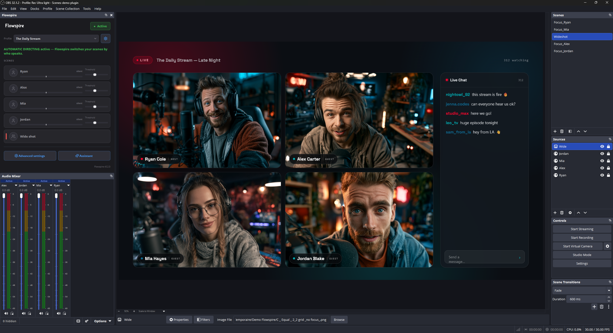 | 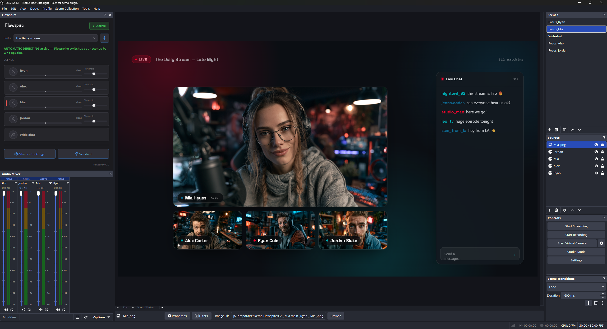 | 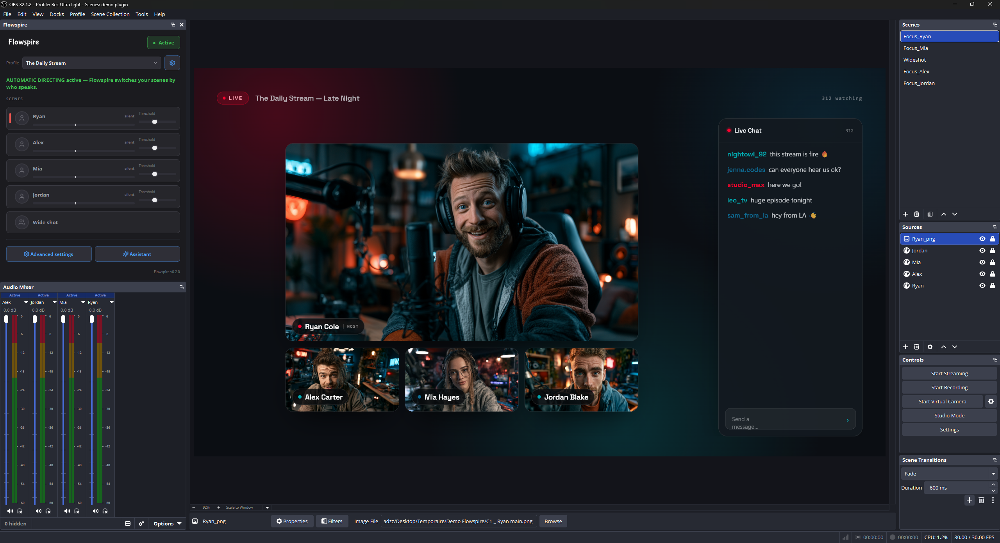 |

### Composer le layout de chaque scène

Dans **chaque** scène, faites votre mise en page comme vous le souhaitez : la personne au centre en grand, les autres en plus petit autour, votre fond, vos overlays, le titre de l'émission, le chat… Tout est libre — Flowspire se contente d'**afficher la bonne scène au bon moment**.

> **Astuce variété :** vous pouvez donner **plusieurs scènes** à une même personne, et Flowspire **alterne** entre elles (la fréquence de chacune se règle avec un **poids** — voir [Caméras & poids](#caméras--poids)). Deux idées qui rendent le résultat plus naturel :
> - un *gros plan* serré **et** un *plan d'écoute* (on la voit réagir, pas seulement parler) ;
> - **le plan large lui-même**, ajouté à son pool avec un **poids très faible** : de temps en temps, même quand elle parle, on prend un plan d'ensemble — ça aère.
>
> **Exemple** pour l'intervenant 1 : *sa caméra **95** · plan large **5** · plan d'écoute **5***. La plupart du temps on le voit en gros plan, mais ça varie juste ce qu'il faut pour que ça respire — encore plus naturel.

### Bonus (non obligatoire) : des transitions animées

Pour un rendu vraiment **smooth et original**, vous pouvez installer le plugin tiers **Move transition** : il permet des **transitions animées** entre vos scènes (les vignettes glissent, grandissent, se réorganisent en douceur au lieu d'un simple fondu). L'effet est bluffant.

> **Ce n'est absolument pas obligatoire.** Flowspire fonctionne parfaitement avec les transitions natives d'OBS (coupe ou fondu). « Move transition » est juste une cerise sur le gâteau pour ceux qui veulent pousser le côté production.

---

## 2. Installer Flowspire

1. Téléchargez l'installeur de votre système depuis la [**dernière release**](https://github.com/DavidClaudeAI/Flowspire/releases/latest) :
   - **Windows** : `flowspire-*-windows-x64.exe` (double-clic)
   - **macOS** : `flowspire-*-macos-universal.pkg`
   - **Linux** : `flowspire-*-x86_64-linux-gnu.deb`
2. Lancez-le (il installe le plugin au bon endroit), puis **fermez et relancez OBS**.
3. Dans OBS, ouvrez le menu **Docks → Flowspire** pour afficher le panneau.

> ⚠️ **Ne sautez pas l'étape 3 — c'est LE piège.** Après l'installation, **OBS n'affiche pas le dock tout seul**. Tant que vous ne l'avez pas activé via **Docks → Flowspire** (barre de menu en haut), le plugin est bien chargé mais **rien n'apparaît à l'écran** — et on croit à tort que l'installation a échoué. Dès que vous l'affichez, la **carte d'accueil** vous accueille et vous guide.

> Nécessite **OBS 28 ou supérieur**.

### Passer l'avertissement « éditeur inconnu »

Le plugin est **open source mais non signé** (la signature de code est payante). À la première ouverture, votre système peut afficher un avertissement — c'est normal, il suffit de l'autoriser une fois :

- **Windows (SmartScreen)** : cliquez sur **« Informations complémentaires »** puis **« Exécuter quand même »**.
- **macOS (Gatekeeper)** : double-cliquez le `.pkg` (l'avertissement s'affiche, fermez-le), puis allez dans **Réglages Système → Confidentialité et sécurité** → section **Sécurité** (tout en bas) → cliquez **« Ouvrir quand même »** → authentifiez-vous. *(Sur **macOS 15+ / 26**, Apple a retiré le « clic droit → Ouvrir » : ce bouton dans les Réglages est désormais le seul moyen.)*

---

## 3. Configurer avec l'assistant

**La première fois, le dock vous accueille avec une carte d'accueil** (« Aucune régie configurée ») : elle vous rappelle de préparer d'abord vos **scènes** et vos **sources audio** dans OBS, indique le nombre de sources audio détectées, et propose un bouton **Lancer l'assistant**. Dès qu'un profil existe, le dock bascule sur son tableau de bord en direct ([section 4](#4-le-dock-en-direct)).

Cliquez sur **Assistant** dans le dock. Il crée une **configuration complète**, appelée **profil**. Vous pouvez en avoir **plusieurs** — un par type d'émission (« Duo », « 4 invités + moi », « Table ronde »…) — et **basculer de l'un à l'autre en un clic** ; on les gère ensuite (charger, renommer, dupliquer, modifier, supprimer) dans la [section Profils](#8-profils).

L'assistant vous guide en **6 écrans**. Tout y reste modifiable à tout moment, et vous pouvez le relancer quand vous voulez.

> Par sécurité, le pilotage automatique démarre **désactivé**. Tant qu'aucun intervenant n'est configuré, le plugin reste en **lecture seule** et ne touche pas à vos scènes.

### Écran 0 — Prérequis

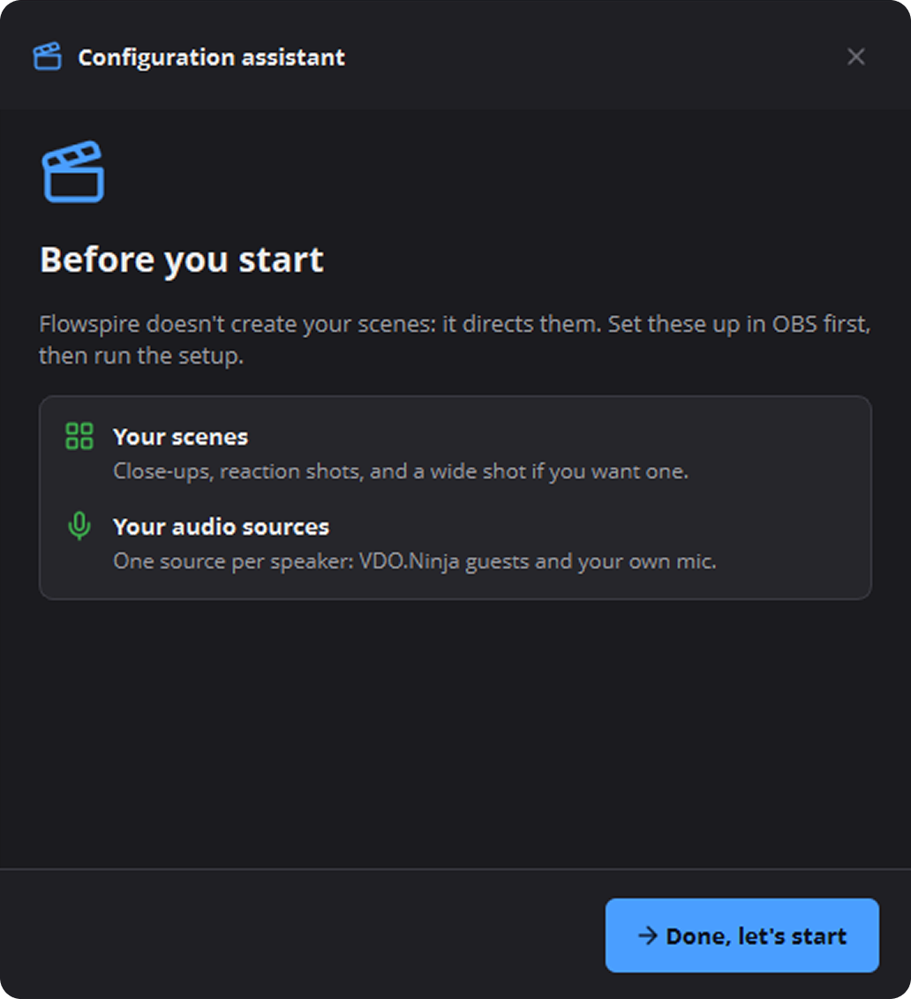

Un rappel : créez d'abord vos **scènes** et vos **sources audio** dans OBS (voir l'étape 1). C'est le point de départ.

### Écran 1 — Intervenants

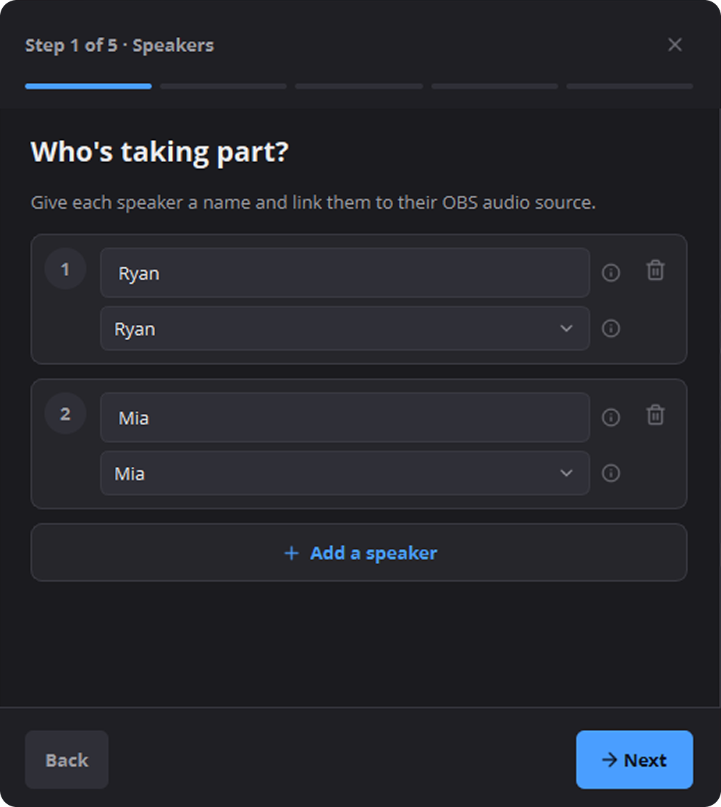

Donnez un **nom** à chaque personne et reliez-la à sa **source audio** OBS (le micro ou le flux qu'on écoute pour savoir si elle parle). C'est le cœur du système.

### Écran 2 — Caméras & poids

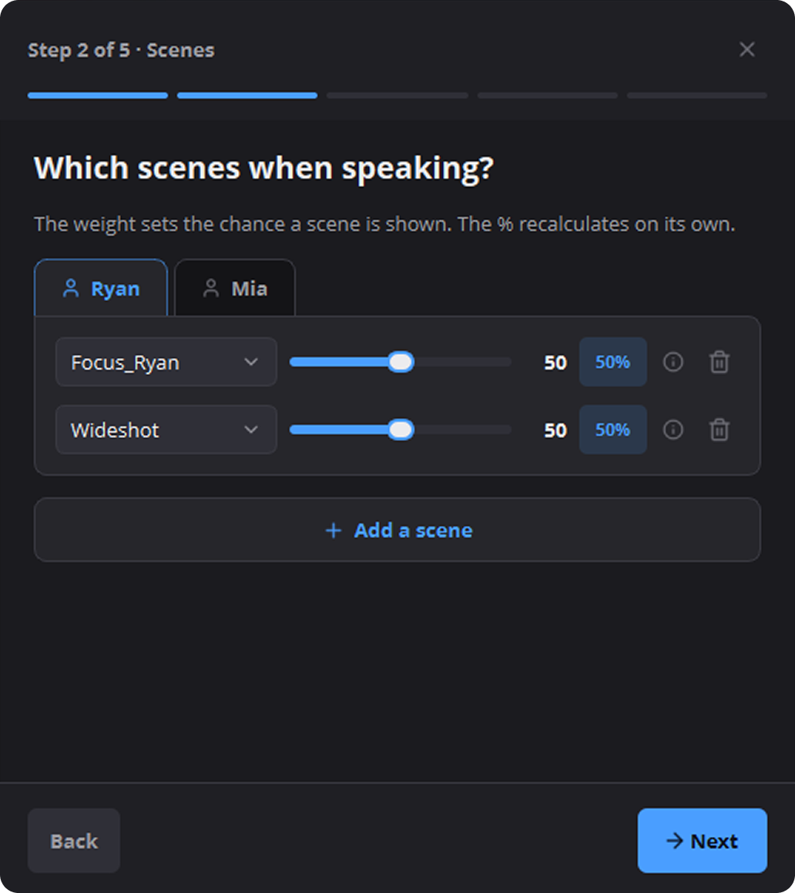

Pour chaque personne, choisissez **quelles scènes** montrer quand elle parle, et donnez un **poids** à chacune (sa chance d'apparaître par rapport aux autres scènes de la même personne). Le pourcentage est recalculé automatiquement.

### Écran 3 — Plan large & priorités

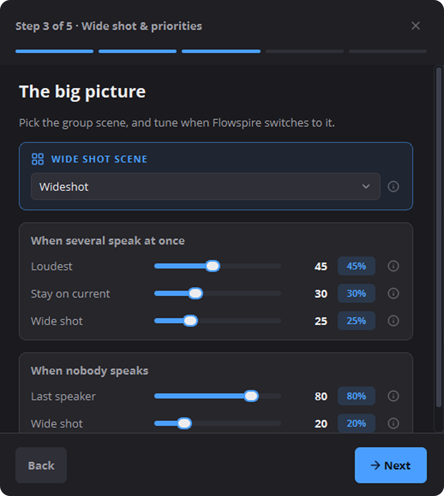

Désignez la **scène de plan large** (le plan de groupe) et réglez **quand y basculer** : la part du plan large quand **plusieurs** parlent, et quand **personne** ne parle.

### Écran 4 — Rythme & sensibilité

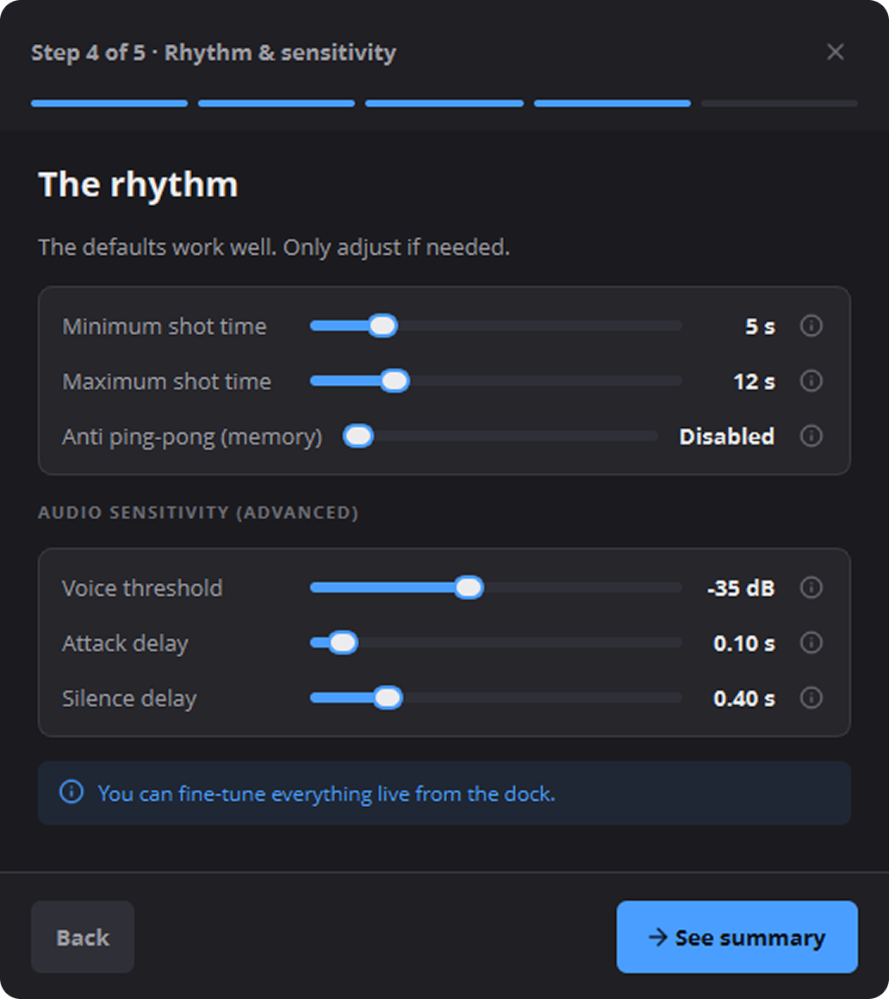

Ajustez le **tempo** (temps mini/maxi d'un plan, délais) et la **détection** (seuil de voix). **Les valeurs par défaut marchent très bien** — laissez-les pour démarrer ; vous les affinerez peut-être plus tard à l'usage, on verra à ce moment-là.

Le **seuil de voix** réglé ici est **général** : c'est le **point de départ** commun à tout le monde. Ensuite, si un micro est plus fort qu'un autre, vous pourrez **ajuster le seuil personne par personne directement dans le dock** (le curseur sous chaque intervenant). *(Détail de chaque réglage : [section 6](#rythme--sensibilité).)*

### Écran 5 — Résumé

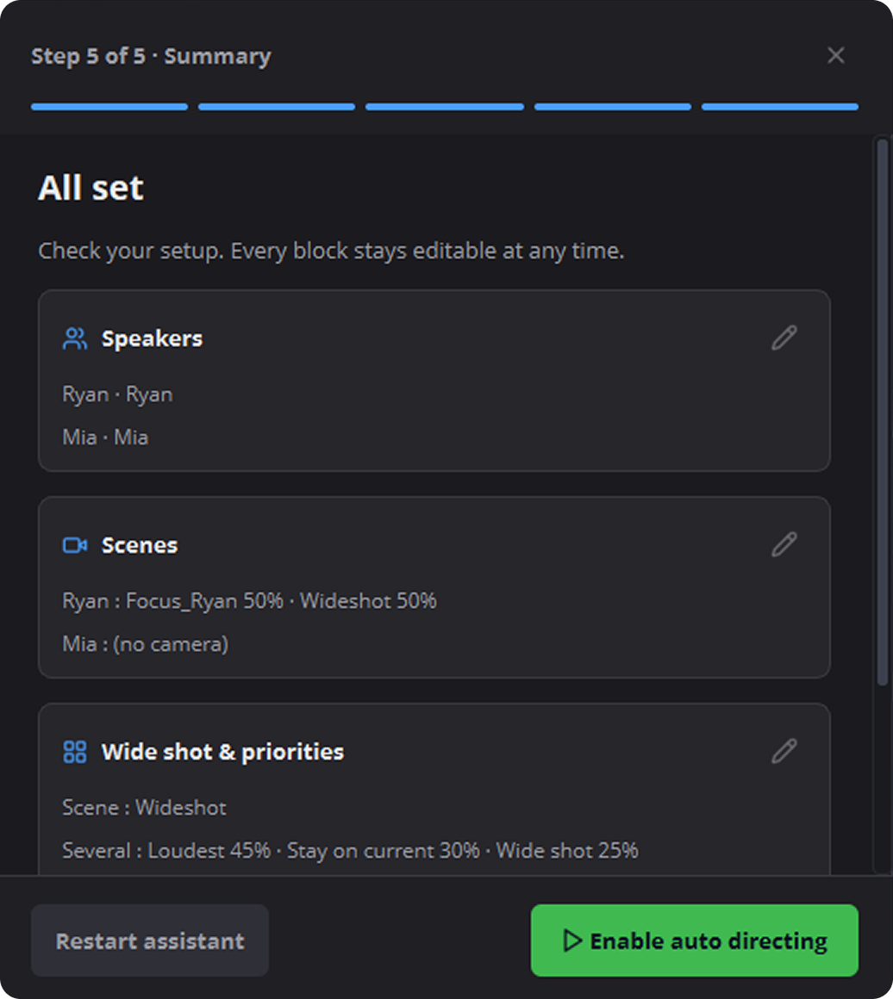

Tout est récapitulé et **reste modifiable**. Un bouton **active la réalisation auto** : à partir de là, Flowspire prend la main et suit qui parle.

---

## 4. Le dock en direct

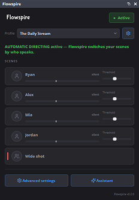

Le dock est votre tableau de bord en temps réel :

- **L'en-tête** affiche le logo et un **badge interrupteur** : *Actif* (le plugin réalise), *En pause* (figé), *Lecture seule* (aucune config). **Un clic** active ou coupe la réalisation auto.
- **Le sélecteur de profil** permet de basculer d'une configuration à l'autre.
- **Le sélecteur « Réalisation »** change le **style** en 1 clic, **en direct** : un menu groupé liste les styles **fournis** (Chill/Cool/Speed), puis, sous un séparateur **« Mes styles »**, ceux que vous avez enregistrés. Affiche **« Perso »** si vous avez ajusté à la main.
- **Chaque intervenant** a son **vu-mètre** et son **curseur de seuil** : le niveau bouge sous le curseur, vous calez la sensibilité **visuellement**. Ce réglage est pris en compte **immédiatement** et **mémorisé** dans le profil.
- **Le témoin « à l'antenne » (tally)** : un **trait rouge** apparaît à gauche de la scène réellement diffusée et **se déplace** quand la réalisation change de plan.
- **Le plan large** figure dans la liste (sans vu-mètre), pour le voir s'allumer lui aussi.
- **Cliquez une carte pour forcer son plan** : cliquer la carte d'un intervenant le passe **à l'antenne**, cliquer la carte du plan large bascule sur le **plan large** — un **forçage temporaire** (l'auto reprend après le temps mini), exactement comme un raccourci. Le **curseur de seuil** reste indépendant (il ne force pas).
- **Calibrer les seuils automatiquement** : le **bouton baguette** sur chaque carte règle le seuil de la personne tout seul — parlez normalement, il trouve le bon niveau (entre votre silence et votre voix) puis le fige (pas de dérive). **Calibrer tous les seuils** (bouton dans l'en-tête SCÈNES) arme tout le monde d'un coup : une barre de progression montre qui est calé ; cliquez **Terminer** quand ça vous va. Fonctionne aussi avec un micro à noise gate (le seuil est placé proportionnellement dans l'écart, jamais collé au plancher).

Vous pouvez aussi piloter via vos **scènes OBS** et vos **raccourcis** : le dock reste volontairement épuré.

---

## 5. Forcer un plan à la main

Même en réalisation auto, vous gardez la main. Le plus rapide : **cliquez une carte dans le dock Flowspire** (un intervenant, ou la carte du plan large) pour passer ce plan à l'antenne. Vous pouvez aussi **cliquer n'importe quelle scène dans le gestionnaire de scènes natif d'OBS** (ou un bouton Stream Deck) et Flowspire la passe à l'antenne :

- Si la scène **fait partie de votre régie** (le plan d'un intervenant ou le plan large) → **forçage temporaire** : le plan tient le temps minimum, puis l'auto reprend.
- Si la scène est **en dehors de votre régie** (une intro, un écran de pause…) → le comportement est **réglable** dans **Paramètres avancés → Paramètres généraux** :
  - **La compter comme un plan** : forçage temporaire, l'auto reprend ;
  - **Mettre la régie en pause** *(par défaut)* : on reste sur la scène jusqu'à réactivation.

---

## 6. Tous les réglages en détail

Tout se règle depuis l'**Assistant** (création guidée) ou les **Paramètres avancés** (édition fine, via le bouton du dock). Voici chaque panneau.

### Intervenants

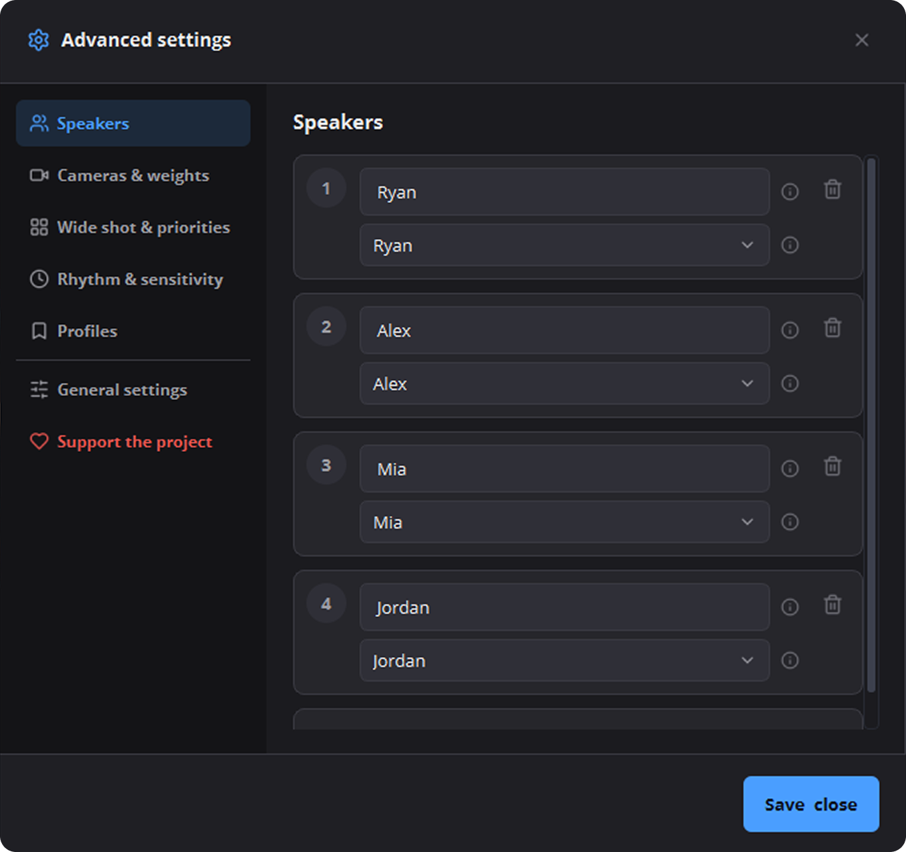

| Réglage | Effet |
| --- | --- |
| **Nom** | Le nom affiché de la personne (juste pour vous y retrouver). |
| **Source audio** | La source OBS qu'on écoute pour savoir si cette personne parle. C'est le cœur du système. |

### Caméras & poids

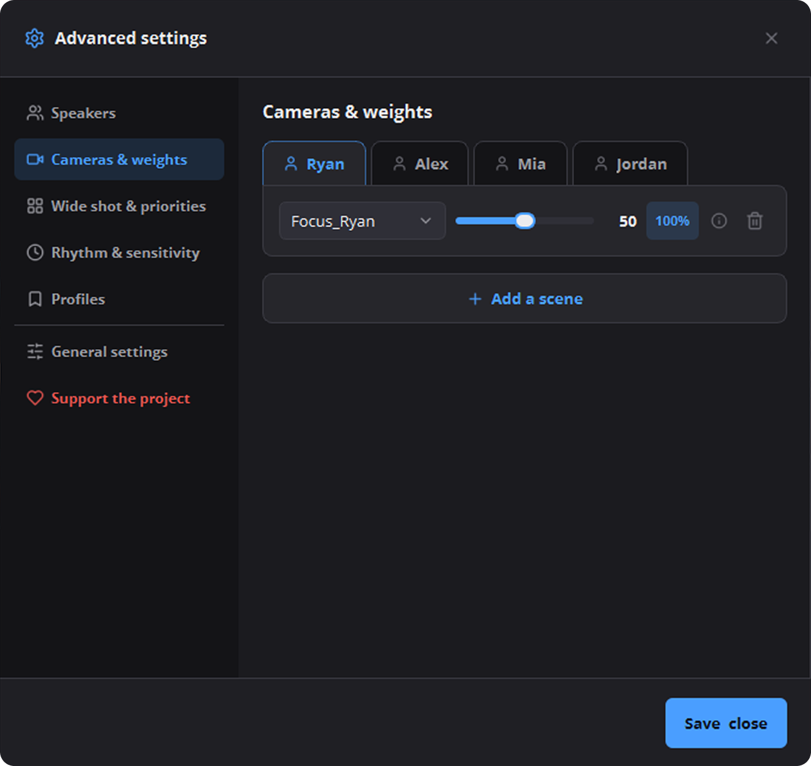

| Réglage | Effet |
| --- | --- |
| **Scène** | Une scène à montrer quand cette personne parle. |
| **Poids** | Plus il est élevé, plus cette scène apparaît souvent **par rapport aux autres scènes de la même personne**. Le % est recalculé automatiquement. |

Ajoutez **plusieurs** scènes à une personne pour obtenir de la variété (ex. *gros plan 90* + *plan d'écoute 10*).

### Réalisation *(ex-« Rythme » + ex-« Plan large », fusionnés en un seul onglet)*

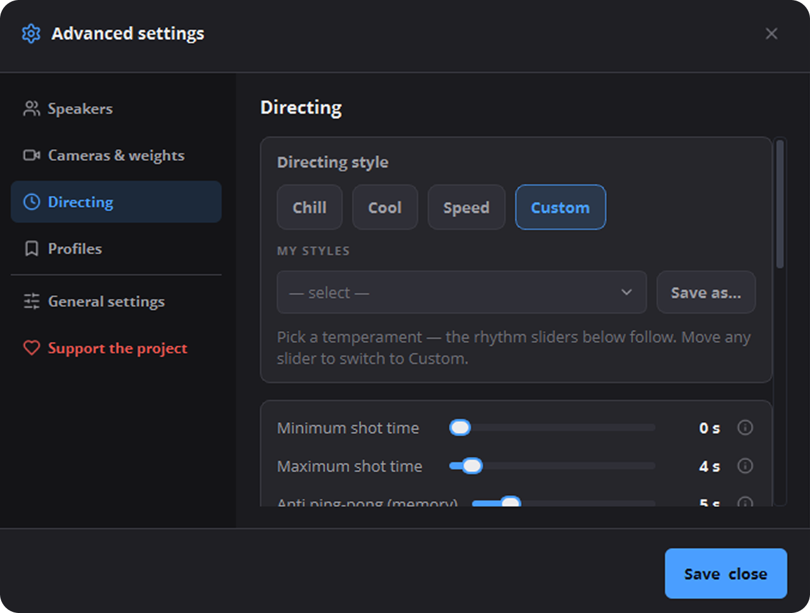

**En haut de la page, le sélecteur de style de réalisation.** Choisissez un **tempérament** d'un clic — **Chill** (posé, plans longs), **Cool** (équilibré, le réglage par défaut), **Speed** (vif, coupes nettes) — et **tous les curseurs se positionnent tout seuls** : le **tempo ET la tendance au plan large**. Dès que vous bougez un curseur à la main, le style passe sur **Perso** (vos valeurs, conservées). Un style définit **tout votre tempérament de réalisation**, mais **ne touche jamais** votre **seuil de voix** ni l'attaque/le silence — ça, c'est de la calibration micro/salle, réglée à part (en bas de la page).

**Vos propres styles (« Mes styles »).** Une fois un réglage qui vous plaît, **« Enregistrer sous… »** lui donne un nom et l'ajoute au menu déroulant **« Mes styles »** — réutilisable sur **n'importe quel show** (c'est une bibliothèque **globale**, indépendante des profils). Vous pouvez **renommer** ou **supprimer** vos styles ; les styles fournis (Chill/Cool/Speed) restent en lecture seule. Les pastilles = les **fournis** ; le menu = **les vôtres**.

**Le tempo :**

| Réglage | Effet | Défaut |
| --- | --- | --- |
| **Temps mini de plan** | Durée minimale d'affichage d'un plan avant qu'un changement soit permis (évite les coupes nerveuses). | 3 s |
| **Temps maxi de plan** | Au-delà de cette durée sur le même plan, on rafraîchit la vue pour varier. | 6 s |
| **Retour au plan large sur échange rapide** | Quand deux personnes se répondent du tac au tac (chacune seule à son tour), au lieu de faire l'essuie-glace on **se recule sur le plan large** le temps que ça respire, puis on repart. **0 = désactivé** ; **n'agit que si un plan large existe** (sinon c'est le temps mini qui régule). | 0 (désactivé) |
| **Délai avant réaction au silence** | Quand **plus personne** ne parle, on **reste sur le plan courant** ce temps avant de basculer (plan large / dernier orateur). Évite de lâcher quelqu'un sur une simple respiration ; s'il reprend dans l'intervalle, on ne l'a jamais quitté. **N'affecte que le silence** : passer à un intervenant qui prend la parole reste immédiat. **« Immédiat »** = bascule sans attendre. | 1,5 s |
**La tendance plan large** *(pilotée par le style)* :

| Réglage | Effet | Défaut (Cool) |
| --- | --- | --- |
| **Scène de plan large** | La scène de groupe, montrée quand plusieurs parlent ou qu'un plan d'ensemble s'impose. **Laissez vide pour ne jamais l'utiliser** (le moteur s'adapte alors sans plan large). | — |
| **Quand plusieurs parlent** | Poids du tirage entre *rester sur l'actuel* / *plan large*. Le **volume n'est plus un critère** (« le plus fort » a été retiré) ; mettre quelqu'un en avant se fait naturellement quand il garde la parole. | rester 5 / large 100 |
| **Quand personne ne parle** | Poids du tirage entre *dernier orateur* / *plan large*. | dernier 5 / large 100 |

**La sensibilité** *(indépendante du style — calibration micro/salle)* :

| Réglage | Effet | Défaut |
| --- | --- | --- |
| **Seuil de voix** | Niveau sonore au-dessus duquel une personne est considérée comme « parle ». Plus bas = plus sensible. | −35 dB |
| **Délai d'attaque** | Durée de voix continue avant de confirmer qu'une personne **commence** à parler (ignore les bruits brefs : clic, choc). Plus court = plus réactif. | court |
| **Délai de silence** | Durée de blanc avant de considérer qu'**une personne** a **fini** de parler (détection par personne — à ne pas confondre avec « Délai avant réaction au silence » ci-dessus). | court |

> **À propos du plan large :** dès qu'on y bascule après quelqu'un, il **tient au moins le « temps mini »** comme n'importe quel plan — pas de « flash » si la parole reprend juste après. *(Seule exception : tout au début, avant que quiconque ait parlé, la première prise de parole est suivie sans délai.)*

> **Tout est pris en compte à chaud.** Dès que vous enregistrez (ou bougez un curseur de seuil dans le dock), le moteur applique le changement **immédiatement** — sans redémarrer le pilotage ni OBS.

#### Seuil par intervenant (réglage en direct)

Le curseur de seuil sous chaque intervenant, dans le dock, **surpasse le seuil global pour cette seule personne**. Pratique quand un micro est plus fort qu'un autre. Ce réglage est **sauvegardé dans le profil actif** et restauré au lancement suivant.

### Paramètres généraux

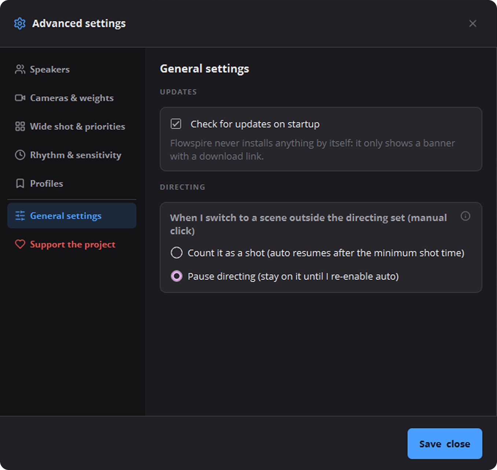

Réglages **globaux** (valables pour tous les profils), appliqués immédiatement :

| Réglage | Effet |
| --- | --- |
| **Scène hors-régie (clic manuel)** | Que faire quand vous passez à la main sur une scène **qui n'est pas dans votre régie** : *la compter comme un plan* (forçage temporaire) ou *mettre la régie en pause* *(par défaut)*. |
| **Vérifier les mises à jour au démarrage** | Le plugin regarde s'il existe une version plus récente et affiche un bandeau le cas échéant. Aucune installation automatique — juste un lien. |

---

## 7. Raccourcis (clavier & Stream Deck)

Flowspire expose ses actions comme des **raccourcis OBS natifs**. Ils n'ont **pas de touche par défaut** : ouvrez **OBS → Paramètres → Raccourcis clavier** et assignez la touche de votre choix (par exemple **F13–F18**, idéales pour un Stream Deck). Une fois assignée, **la touche est mémorisée** et conservée d'un redémarrage d'OBS à l'autre.

| Action (libellé dans OBS) | Effet |
| --- | --- |
| **Flowspire : activer/désactiver le pilotage auto** | Marche/arrêt de la réalisation automatique. |
| **Flowspire : forcer le plan large** | Bascule immédiatement sur le plan large. |
| **Flowspire : forcer l'intervenant 1 … 8** | Bascule immédiatement sur la personne choisie (jusqu'à 8 raccourcis). |

> Sur un **Stream Deck**, ajoutez un bouton *Touche* / *Hotkey* qui envoie la même touche que celle assignée dans OBS : le bouton pilote alors Flowspire. Au-delà de 8 personnes, **forcez le plan directement depuis le gestionnaire de scènes natif d'OBS** (un clic = un forçage temporaire).

> **Vos raccourcis de scènes habituels continuent de fonctionner.** Si vous aviez déjà des raccourcis OBS qui basculent directement sur une scène (clavier ou Stream Deck), les utiliser pendant la réalisation auto revient à **forcer ce plan** — exactement comme un clic sur la scène. Rien à réapprendre.

### Reprendre la main pendant le live

- **Forcer un plan** (une personne ou le plan large) : bascule immédiate, puis les règles normales reprennent.
- **Mettre en pause** (Auto OFF) : le plugin **fige** la scène actuelle et arrête de switcher.
- **Reprendre** (Auto ON) : il repart de qui parle à cet instant.
- Changer une scène **manuellement** dans OBS rend aussi la main au plugin proprement.

### Afficher l'état de la régie sur un bouton (Bitfocus Companion)

Vous pouvez faire **changer un bouton de couleur** selon que la régie auto est active ou non — **sans installer le moindre module**.

1. Dans **Companion**, créez une **variable personnalisée** nommée `flowspire_active` (*Variables → Custom Variables*).
2. Dans **Flowspire → Paramètres → Paramètres généraux → Connexion externe**, cochez *Envoyer le statut…*, puis indiquez l'**adresse IP** de la machine où tourne Companion (`127.0.0.1` si c'est la même) et le **port** (**8000** par défaut).
3. Sur votre bouton Companion, ajoutez un *feedback* **« Variable value »** : si `$(custom:flowspire_active)` vaut `1` → fond vert « EN RÉGIE », sinon gris.

Flowspire y écrit `1` quand la régie auto est active, `0` sinon — à chaque bascule, au démarrage, et toutes les 15 s (re-synchro si Companion redémarre). Tout passe en **HTTP local** : aucun module, aucun câble.

> Pour **commander** la régie depuis le même bouton (appui = marche/arrêt), assignez une touche au raccourci *« Flowspire : activer/désactiver le pilotage auto »* (plus haut) et déclenchez-la depuis Companion via le module **OBS**. Un seul bouton commande **et** reflète l'état.

---

## 8. Profils

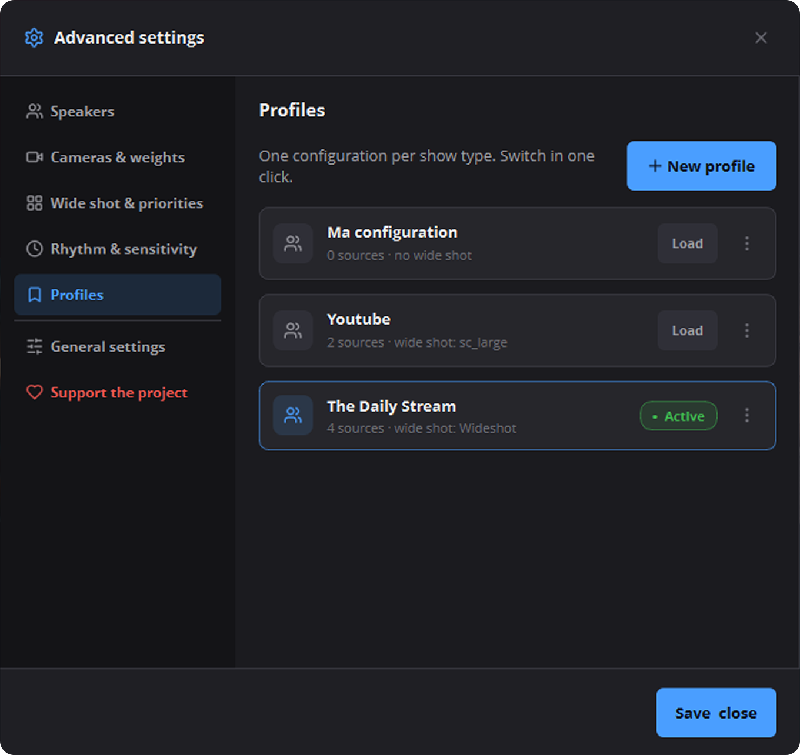

Un **profil** = une configuration complète (intervenants, scènes, plan large, rythme). Créez-en un par type d'émission (« 4 invités + moi », « Duo », « Table ronde »…) et **basculez de l'un à l'autre en un clic** depuis le dock.

- Création via l'**assistant** (guidée) ou **profil vierge** (à remplir dans les paramètres).
- Actions par profil : **charger**, **renommer**, **dupliquer**, **éditer**, **supprimer**.
- Le **profil actif** est la **source de vérité** lue par le moteur.

---

## 9. Où sont stockés les réglages

Les profils vivent dans le dossier de config d'OBS :

```
Windows : %APPDATA%\obs-studio\plugin_config\flowspire\profiles\
macOS   : ~/Library/Application Support/obs-studio/plugin_config/flowspire/profiles/
Linux   : ~/.config/obs-studio/plugin_config/flowspire/profiles/
```

- `index.json` = catalogue des profils + profil actif.
- `<id>.json` = le contenu d'un profil.

Les **réglages d'application** (Paramètres généraux) et les **touches de raccourcis** que vous assignez vivent dans le dossier parent `flowspire/` (`prefs.json` et `hotkeys.json`), avec la même protection.

Toute écriture est **atomique** avec sauvegarde `.bak` ; un fichier illisible est récupéré automatiquement. Vous n'avez **jamais besoin d'éditer ces fichiers à la main** — l'interface fait tout.

---

[← Retour au README](../README.fr.md)
